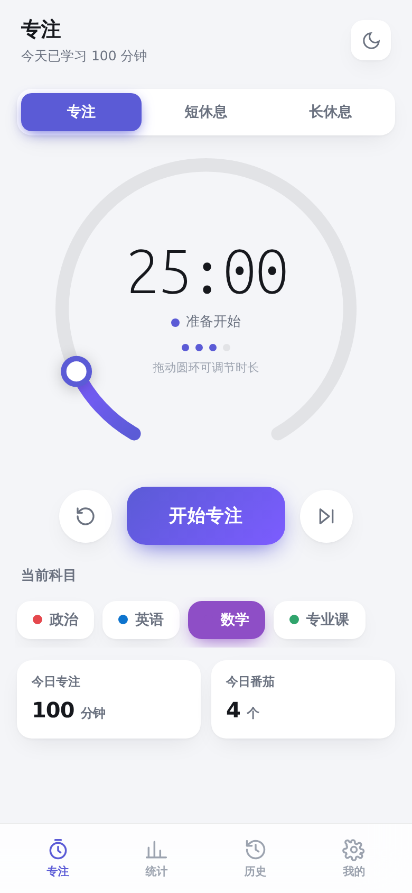
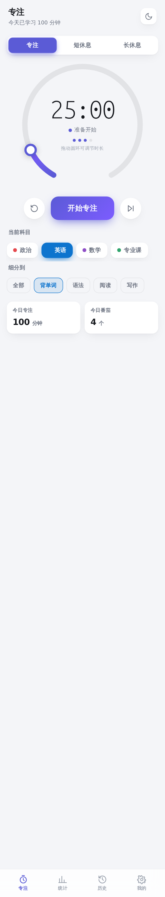
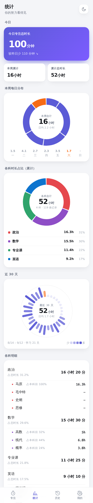
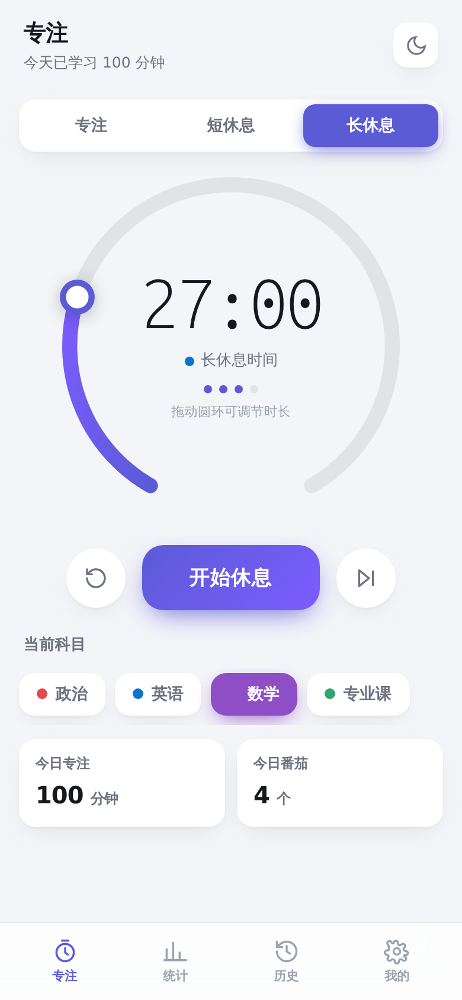

# 考研番茄钟

一个专门为考研做的番茄钟 App：**按科目记录每一科的学习时长，并统计总时长**。

> 本仓库只用于**分发安装包**，不包含源代码。

---

## ⬇️ 下载安装

### 最新版本

**👉 [点这里下载最新版 APK](https://github.com/yalishanda1/kaoyan-pomodoro-releases/releases/latest)**

也可以在下方「版本记录」里选择指定版本下载。

| | |
| --- | --- |
| 适用系统 | Android 8.0 及以上 |
| 安装包大小 | 约 1.3 MB |
| 是否联网 | **完全不联网**，数据只存在你自己手机里 |

### 安装步骤

1. 用手机浏览器打开上面的下载链接，点 `.apk` 文件下载
   - 若提示「此类文件可能有害」→ 选择 **保留 / 仍然下载**
2. 下载完成后点击安装
   - 若提示「未知来源应用」→ 选择 **允许**（设置 → 应用 → 特殊权限 → 安装未知应用）
3. 首次点「开始专注」会申请**通知权限**，建议点允许 —— 否则锁屏收不到结束提醒
4. 建议把本应用的**电池优化设为「不限制」**，避免后台被系统清理导致计时中断
   - 小米：设置 → 应用设置 → 应用管理 → 考研番茄钟 → 省电策略 → 无限制
   - 华为：设置 → 应用 → 应用启动管理 → 考研番茄钟 → 手动管理，全部打开
   - OPPO / vivo：设置 → 电池 → 后台耗电管理 → 允许后台运行

---

## ✨ 功能

### 番茄计时
- 专注 / 短休息 / 长休息三种模式，时长全部可调（5~180 / 1~60 / 5~90 分钟）
- **圆环就是旋钮**：没开始计时时，手指在圆环上转圈即可调时长，每转 1 分钟有一次轻微触感反馈
- 长休息间隔可调：每完成 N 个番茄进入一次长休息

### 按科目记录时长
- 预置**政治、英语、数学、专业课**，可任意增删改、换配色
- **支持二级细分**：例如「英语 → 背单词 / 语法 / 阅读 / 写作」，
  已按考研常见分法预置好，也可以自己加
- 计时页点一下即切换科目，选「背单词」就单独计这一项的时长

### 统计
- **今日**专注总时长 + 与昨天对比
- **本周每日圆盘**、**各科占比圆盘**、**近 30 天圆盘日历**
- **各科明细**展开到细分项，标出「占本科目 44%」这样的占比
- 累计总时长、累计番茄数、近 7 天日均

### 其他
- **锁屏 / 后台继续计时**：通知栏实时倒计时，可直接在通知上暂停 / 跳过 / 结束
- **结束提醒**：响铃 + 振动 + 通知
- 历史记录按天分组，长按可删除单条
- 深色 / 浅色 / 跟随系统三种主题
- 数据导出 CSV（Excel 可直接打开）
- **完全离线**，不需要注册登录，不上传任何数据

---

## 📸 界面预览

| 专注（圆环可拖动调时长） | 细分到「英语 · 背单词」 |
| --- | --- |
|  |  |

| 统计（圆盘图表 + 细分明细） | 长休息 · 旋钮调到 27 分 |
| --- | --- |
|  |  |

---

## 📋 版本记录

| 版本 | 日期 | 说明 |
| --- | --- | --- |
| **v1.1** | 2026-09-12 | 修复：「我的」页提示文字重叠；修复从旧版升级后科目细分项没被自动补上的问题 |
| v1.0 | 2026-09-12 | 首个版本：番茄计时、科目细分、圆盘统计、锁屏计时、CSV 导出 |

> **从 v1.0 升级的用户请装 v1.1** —— v1.0 有个时序问题会导致预置的科目细分项没出现，
> v1.1 已修复，升级后会自动补上。你的学习记录不会丢。

---

## ❓ 常见问题

**Q：装的时候提示「应用未安装」？**
A：多为下载不完整，或与已装的同包名应用冲突。先卸载旧版本（如果有），重新下载安装。

**Q：计时到点没响？**
A：检查两点：① 是否允许了通知权限；② 系统电池优化是否限制了本应用。把省电策略设为「无限制」。

**Q：手机锁屏后计时会停吗？**
A：不会。App 使用前台服务，锁屏后继续计时。

**Q：数据会上传吗？**
A：不会。App 没有联网权限，所有数据只写在手机本地。

**Q：换手机怎么迁移数据？**
A：在「我的 → 数据 → 导出 CSV」把记录导出来留档。

---

## ©️ 版权

版权所有 © 2026 yalishanda1。保留所有权利。

本软件为私有作品，仅供个人学习使用。未经著作权人书面许可，不得复制、修改、
再分发或用于任何商业用途。详见 [LICENSE](LICENSE)。
